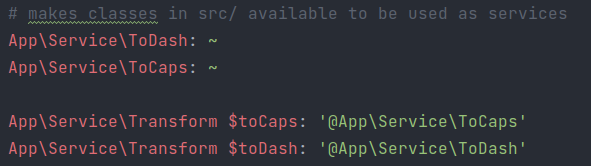
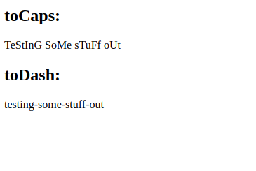
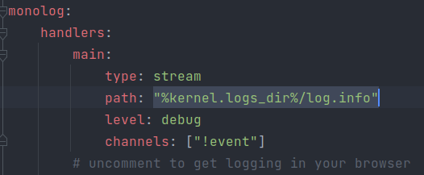

# Dependency injection in Symfony <!-- Exercise title -->

<!-- ## published site -->

<!-- ## screenshot of user stories -->

<!-- ## link to the project board and tickets -->

### exercise in week 16 (10/01/2022 - 15/01/2022)<!-- NR (from date - to date)--> of our BeCode training
You can find the original exercise readme [by clicking here](https://github.com/becodeorg/ANT-Lamarr-5.34/tree/main/3.The-Mountain/Symfony/2.Dependency%20Injection)

## Table of content

|     |                                                                         |
|-----|-------------------------------------------------------------------------|
| 1   | [Challenge](#challenge)                                                 |
| 2   | [The objective of this exercise](#the-objective-of-this-exercise)       |
| 3   | [The group](#the-group)                                                 |
| 4   | [Tools and languages used](#tools-and-languages-used)                   |
| 5   | [Timeline](#timeline)                                                   |
| 6   | [What I learned from this exercise](#what-i-learned-from-this-exercise) |
| 7   | [To Do](#to-do)                                                         |
| 8   | [Installation Instructions](#installation-instructions)                 |
|     |                                                                         |

## Challenge

Time for a new framework! After weeks of PHP we are getting started with one of its most popular frameworks,
namely, [Symfony](https://symfony.com/) (I will be using Symfony 6 throughout these exercises).
Our coaches have provided us with [a series of 3 exercises](https://github.com/becodeorg/ANT-Lamarr-5.34/tree/main/3.The-Mountain/Symfony)
to get a basic understanding of how Symfony works and what it can do for us.  
In the second exercise we will be:
* learning about dependency injection in PHP (using Symfony)
* using the DI container in Symfony
* learning how to configure services and dependencies

## The objective of this exercise

Understand the value of the DIL (dependency Injection Layer) by following the instructions provided [here](https://github.com/becodeorg/ANT-Lamarr-5.34/tree/main/3.The-Mountain/Symfony/2.Dependency%20Injection)
By the end of this exercise I should have a good understanding of how the DIL connects to Polymorphism and the SOLID principles.

## The group
<!--give credit where it's due and link to group member's GitHub pages-->
This is a solo exercise
## Tools and languages used

<!--Adjust the content of this table per exercise
Logos are added on a project basis, I have them stored in a separate folder locally, ready for copying-->

|                                           |                                             |                                         |
|-------------------------------------------|---------------------------------------------|-----------------------------------------|
|    |  |  |
|  |  |      |
|          |            |  |

## Timeline
<!-- fill in the timeline with what happened, challenges and how you overcame them, little victories, link to your sources if possible -->
- day 1(:date: 10/01/2022):
    - I started this exercise at the end of the day by initiating a new symfony project
    - I also created the remote repository and ran `git init` in the project root
    - The readme was updated to fit this exercise
    - Then it was time to call it a day and go hit the gym :runner:
- day 2(:date: 11/01/2022):
    - the exercise readme linked to several sources on Dependency Injection, so I read/watched those in order to at least have some understanding of what I'll be working with today
    - after spending hours hitting error after error, I scrapped the exercise and started over because I figured I might have instantiated my interface and classes in the wrong place
    - then git and GitHub decided to be a pain, but doing the following got me back to the start:
      - in the parent-folder of my project root I ran `symfony new dependency-injection --full`
      - on GitHub, I created a new repository without a readme
      - I then ran following commands in the project root folder:
        - `git init`
        - `git remote add origin git@github.com:<username>/dependency-injection.git`
        - `git branch -M main`
        - `git push -u origin main`
      - Now I can finally get back to this exercise
    - This time I'll be instantiating my interface and classes as part of the src/Service folder
    - First I created:
      - interface Transform
      - class ToCaps
      - class ToDash
      - class Logger
    - Then I created a HomepageController using `symfony console make:controller`
    - In that controller I added `USE App\Service\Transform` with the other USE lines
    - In the class I then passed the created classes to the constructor using the Transform type declaration
    - I had to add the following lines to my `./config/services.yaml` file in order to allow the auto-wiring of the service/interface
      - 
    - In the controller I passed a test $string to the methods and got this output:
      - 
    - I adjusted the Logger class to use the Logger interface through its constructor
    - Made adjustments to the HomepageController to call the class Logger through the constructor
    - Passing the $string to the Logger to log to the log.info file (I adjusted the path in `.\config\dev\monolog.yaml` as well as `.\config\prod\monolog.yaml`)
      - 
    - it still writes more than just the $string to the log.info file, will ask coach Tim after lunch what that is about.
    - After lunch, I went to coach Tim about my Logger logging all app level messages in the log.info
    - After some searching and brainstorming I figured out I could play around with the log LEVELS to filter out the messages
    - I now log my $string at the 'ALERT' level and in the monolog.yaml file I set the log levels to ALERT as well
    - It appears to be working since I now only get the $string logged in my log.info file
    - Next I added an Entity Input and a form for that entity
    - The HomepageController handles the form through the $request and sets the $output variables after form validation
    - The outputs then get echoed onto the screen.
    - I added the dropdown to select the transformation type and depending on the user's selection the input gets then re-rendered through the corresponding transformation
    - Not sure what the exercise means when it says not to change anything in the Master class... I had to implement the if{}else{} in the HomepageController to call the correct method.
    - Will have to ask Tim about that.
    - Alright, apparently, I was supposed to build a separate Master class that calls the Transform interface and the ToDash and ToCaps classes that implement said interface
    - Then in the HomepageController I can instantiate a new Master and call its defined methods depending on the user input.
    - At the end of the day I managed to get the Monolog logger working. since I'm no longer my own Logger class I removed the call from the Master and now log directly from the HomepageController
    - :exclamation: I kept the file for the Logger class to keep the code available for review
    - :tada: exercise done

## What I learned from this exercise
<!--here you can write anything from a short summary on the subject of the exercise, a readable description of the new skills/knowledge you acquire, to an in depth clarification. As long as it helps you retain what you learned, or easily find the information when working on future projects-->
Trying to complete this exercise, I hit quite a few roadblocks and bumps along the way. At first, I got errors from PHPStorm, so I deleted my files locally and cloned the GitHub repository again
That caused more issues since I forgot to run `composer install` (read your own README dummy!)
Then  I misunderstood where to instantiate my interface and classes, so I got runtime errors aplenty. Before the morning was over I had had quite enough and ended up scrapping what I had and starting fresh.
I reread all the documentation I could find ([this blogpost by Julien Maury](https://blog.julien-maury.dev/en/make-sense-of-php-interfaces/),[this class on symfonycasts.com](https://symfonycasts.com/screencast/oo-ep3/interfaces),[the PHP manual chapter on Interfaces](https://www.php.net/manual/en/language.oop5.interfaces.php), and more)
 and figured out I could create my files in a new Service folder.
From there I had to slow down and take it one step at a time. Dependency Injection is a complicated matter and it can cause more issues than it fixes sometimes. But when it works it looks great and makes your code
that much more readable. Although, I did get spaghetti vibes at times.

## To Do

This to do list is for personal use, the full to do list is added at the start of the challenge and as we complete
objectives they will be moved up into the timeline section and ticked off using emotes such as :heavy_check_mark:

<!--For now, this list is usually provided by BeCode and thus quite static. When working on outside projects, this list will become more dynamic as the projects grow and evolve-->

### must-haves
* interface transform :heavy_check_mark:
  * requires public function transform(string $string):string :heavy_check_mark:
* class ToCaps implements Transform (using DI) :heavy_check_mark:
* class ToDash implements Transform (using DI) :heavy_check_mark:
* class Logger that logs input into log.info file :heavy_check_mark:
* class Master constructed from Transform, Transform, Logger and input :heavy_check_mark:
  * with methods linking to classes ToCaps, ToDash, Logger :heavy_check_mark:
* HomepageController :heavy_check_mark:
  * takes user input from form and passes it to the new Master :heavy_check_mark:
  * then based on user input returns the correct transformation to the browser output :heavy_check_mark:

### Nice to have
* Change your Logger class for Monolog. In this case you will not use your own logger class anymore. :heavy_check_mark:

## Installation Instructions
<!--write clear instructions on how to get your project working on the user's local environment-->
1. clone this repository to your local environment
2. have [Symfony CLI](https://symfony.com/doc/current/setup.html#technical-requirements) installed
3. make sure you are running Symfony 6 `symfony console --version` or `bin/console --version`
4. check that symfony is using php8.1 `symfony local:php:list`
5. if not update your php version and run `echo 8.1 > .php-version` in the project root folder
6. run `symfony server:start` to start the built-in dev-server